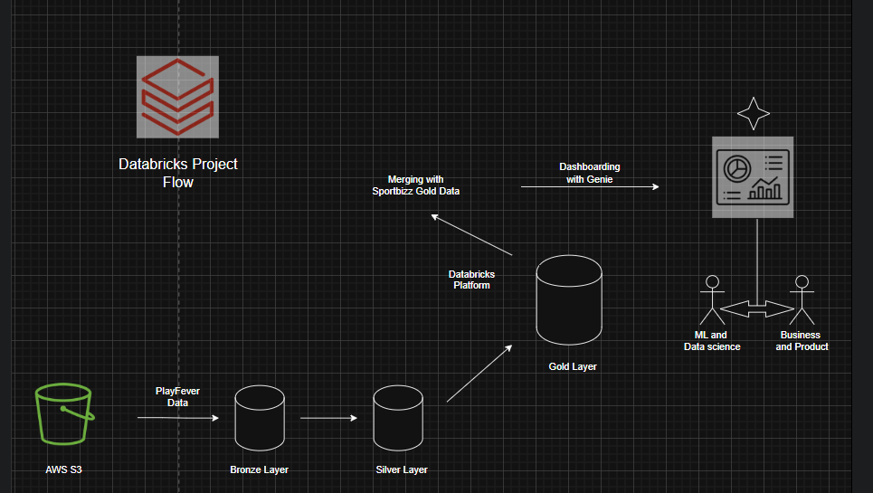

# 🏅 SportsData Medallion Pipeline

An end-to-end data engineering pipeline built on **Databricks** and **AWS**, implementing the **Medallion Architecture (Bronze → Silver → Gold)** for a sports business domain. The pipeline handles both full load and incremental data ingestion, applies data quality checks, and delivers business insights via Databricks SQL Dashboards.

---

## 🏗️ Architecture



---

## 🛠️ Tech Stack

| Tool                           | Purpose                                        |
| ------------------------------ | ---------------------------------------------- |
| **AWS S3**                     | Parent pipeline — raw data landing zone        |
| **Databricks (Unity Catalog)** | Data processing, Delta Tables, orchestration   |
| **PySpark**                    | Transformations and data quality checks        |
| **Delta Lake**                 | ACID transactions, upsert (MERGE), time travel |
| **Databricks SQL**             | Schema/catalog creation, dashboards            |
| **Databricks Workflows**       | Pipeline orchestration                         |
| **Shell Scripting**            | File management and automation                 |
| **GitHub**                     | Version control                                |

---

## 📂 Project Structure

```
SportsData-Medallion-Pipeline/
│
├── Architecture/
│   ├── ArchitectureImage.png
│   ├── ProjectArchitecture.drawio
│
├── ChildCompanyDAG/
│   ├── DAGImage.png
│
├── data/
│   ├── 1_parent_company
│   └── 2_child_company
│
├── Data_Processing/
│   ├── dimension processing
│   └── Fact processing
│
├── PlayFever/
│   └── setup.py
│
├── Sportbizz/
    |__ CatalogSetup.py
    |__ dim_date_table_creation.py
    |__ utilities.py
└── README.md
```

---

## 🔄 Pipeline Flow

```
Landing Zone (Raw Files)
        ↓
    Bronze Layer        ← Raw data, full load, overwrite
        ↓
    Silver Layer        ← Cleaned, validated, MERGE/upsert
        ↓
    Gold Layer          ← Aggregated, business-ready, CDF incremental
        ↓
Databricks SQL Dashboard
```

---

## ✅ Data Quality Checks (Silver Layer)

- Null value handling and imputation
- Duplicate record removal via `dropDuplicates()`
- Column validation using regex patterns (`rlike`)
- Invalid records flagged and separated for business review
- Multiple date format standardization via custom UDF
- Whitespace trimming and case standardization
- Schema enforcement across all layers

---

## 📊 Medallion Architecture

### 🥉 Bronze Layer

- Raw data ingested as-is from landing zone
- No transformations applied
- Full load with overwrite mode
- Acts as immutable source of truth

### 🥈 Silver Layer

- Data cleaning and standardization
- Regex-based column validation
- Invalid records routed to separate table for review
- Talk to business about invalid and NULLs to replace with recommended values using joins.
- Incremental upsert using Delta Lake `MERGE` on composite keys
- Composite primary keys used for deduplication

### 🥇 Gold Layer

- Business-level aggregations
- Fact and dimension tables
- Bringing child company silver data into format of parent company and selective columns.
- Incremental processing using **Change Data Feed (CDF)** from Silver
- Optimized for dashboard consumption

---

## 🔑 Key Features

- **Incremental Load** — Delta Lake MERGE with composite keys ensures no duplicates
- **Change Data Feed (CDF)** — Gold layer processes only changed Silver rows, reducing compute cost
- **Invalid Record Handling** — Bad data separated and flagged for business review
- **Schema Consistency** — Centralized schema config ensures uniform datatypes across all tables
- **Landing → Processed → Archive** — Safe file movement pattern preserving raw data
- **Dynamic Date Parsing** — Custom PySpark UDF handles multiple date formats in one pass
- **Orchestration** \_ Created a DAG using Jobs/Pipeline Workflows feature on Databricks for incremental update for automating the pipeline and scheduling on required basis

---

## 📈 Databricks SQL Dashboard

Business insights built on Gold layer tables:

- Quarterly sales trends
- Product performance by category
- Customer order analysis
- Revenue aggregations by division

---

## 🗂️ Datasets

Synthetic sports business data generated using **Mockaroo** and **Python Faker**, covering:

- Customers
- Products (with variants)
- Orders
- Gross pricing

---

## 🚀 How to Run

1. Clone this repository
2. Upload raw CSV files to your landing zone path in DBFS/S3
3. Run Bronze notebooks to ingest raw data
4. Run Silver notebooks to clean and validate
5. Run Gold notebooks to aggregate and build fact/dim tables
6. Open Databricks SQL Dashboard for insights

---

## 👨‍💻 Author

**Abhiraj Shrivastava**
Data Engineer | Capgemini(FTE) × IDFC First Bank(FTC)
[GitHub](https://github.com/abhirajshri09) • [LinkedIn](https://linkedin.com/in/abhiraj09/)
